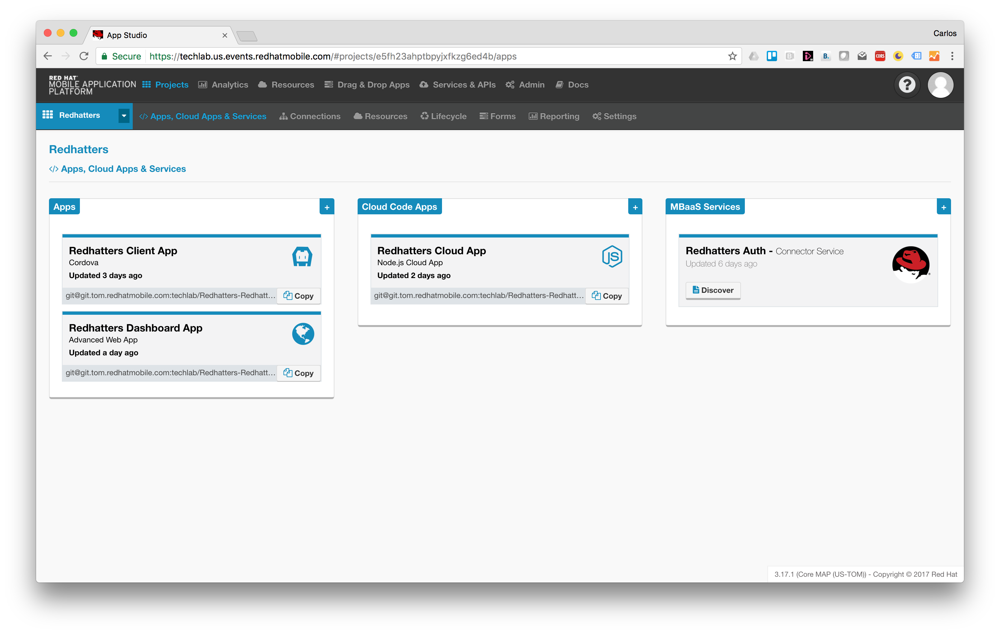
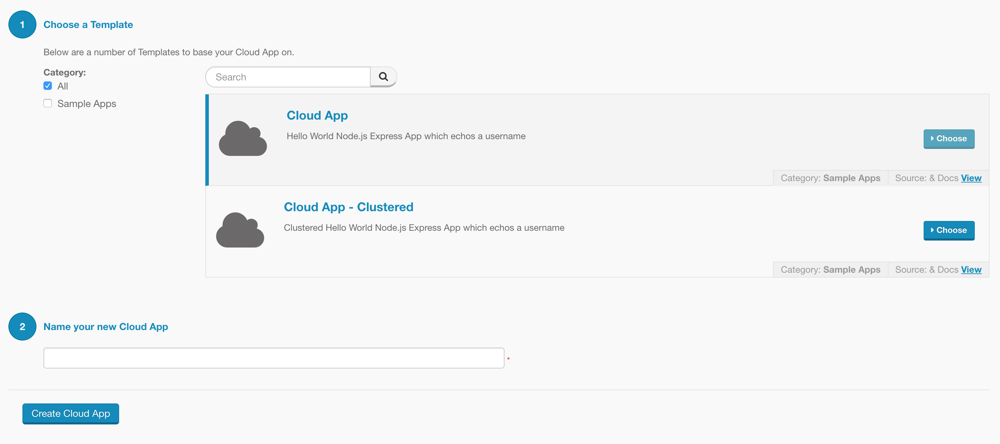

# Introduction
When I was first approached to create an application for an event involving an interactive quiz I immediatly got excited because it sounded both cool and challenging.

The idea evolved to a hybrid app were attendees to the event could see the agenda of an event and participate in an interactive quiz.

After the scoping session I had a pretty clear idea, we would need:

* **A client app** (hybrid both because of the timeframe 1 week maximum and also because the UI didn't seem to exigent) 
* **A dashboard web app** to show the quiz results live and historic data, 
* **Some short of repository** for the event agenda, quiz definition, etc.
* **A user repository** and user/pass authentication
* **An interactive protocol to deal with quiz questions and answers**
* **And a place to run these apps API**: so far including some REST APIs, getting the events for the current date, getting the quiz questions, storing attendees answers, etc.

All in one week... nice.

At least I had a couple of secret weapons, I had access to a Red Hat Mobile Application Platform (RHMAP for short) and a lot of enthusiasm.

**Disclaimers**

* This is just a sample mobile project meant to show how easy is to develop mobile and web apps using socket.io, angular 2+ and Ionic 2 within Red Hat Mobile Application Platform
* Some minimum knowledge of RHMAP, Ionic and Angular is needed in order to understand the content that follows

# Selecting technology

Regarding the client app I was clear, Ionic 2, cleaner code (thanks to Angular 2 and Typescript) and I had been using Ionic 1 for quite some time successfully on RHMAP. What could go wrong?

Some sort of interactive protocol... hmmm, that sounded pretty much like websockets. I had run some examples using socket.io and I knew some other redhatters had used socket.io on RHMAP. So, socket.io.

The dashboard... why not Angular 2+ (again cleaner and object oriented) plus Bootstrap 4? Maybe a bit bold here... Bootstrap 4 is still alpha... but I had used it before with no issues. So I took my chances.

Security, storage (for events, agenda, quiz, results, users, etc.) and running the APIs, all covered by RHMAP so I just have to care about the business logic of my apps.

# Implementation details
The final assets generated as part of this experience can be summarized as follows.

* 1 x Hybrid Client App (Ionic 2) [code](https://github.com/cvicens/Redhatters-Client-App)
* 1 x Responsive DashBoard to show Quiz results live/historic [code](https://github.com/cvicens/Redhatters-Dashboard-App)
* 1 x Cloud App (featuring socket.io set up for the interactive Quiz) [code](https://github.com/cvicens/Redhatters-Cloud-App)
* 1 x Authentication MBaaS Service [code](https://github.com/cvicens/Redhatters-Auth)

Thanks to the project view in RHMAP we can gather together all these 4 components an see/manage them as a whole (as well as indivually). Next picture will hopefully help to understand this.



Now let me explain some relevant details about them.

## The Client App

To accelerate the development on RHMAP we usually start developing apps from a template, in this occasion the template had to be Ionic 2 based so I used [this](https://github.com/cvicens/quickstart-ionic-v2-tabs).

*Beware that in order to use Ionic 2 you need Node.js 6. Please go [here](https://ionicframework.com/docs/intro/installation/) for an explanation about the minimum requirements*

You might be wondering what's added to the base Ionic 2 tab template. Well, let me explain the main differences below, but basiclly changes were as follows:

1. Adding RHMAP SDK
2. Adding a script to copy RHMAP configuration file to ``www``
3. Modifying ``.gitignore`` to version control ``www``

### Adding RHMAP SDK

Because we'll need RHMAP SDK for Javascript, I installed ``fh-js-sdk`` package by executing ``npm install fh-js-sdk --save``. So in the ``dependencies`` area of ``package.json`` you'll see this entry ``"fh-js-sdk": "^2.18.4"``, as in:

```
  "dependencies": {
    "@angular/common": "2.4.8",
	 ...
    "fh-js-sdk": "^2.18.4",
    ...
  }
```

**But... wait... is it possible to use RHMAP SDK within Typescript?**
Indeed! You can even use proper typing! 
To test this just open your favorite IDE (like atom or VS Code) and Ctr+Space after the variable where you have imported RHMAP SDK. For instance in the following snippet the variable would be ``$fh``.

```
import * as $fh from 'fh-js-sdk';

$fh. <== Ctrl+space
```


Next snippet is part of the App source code and shows how to use it.

```
import * as $fh from 'fh-js-sdk';
...
$fh.cloud(
    params, 
    (data) => {
      resolve(data);
    }, 
    (msg, err) => {
      // An error occurred during the cloud call.
      console.log('Cloud call failed with error message:' + msg + '. Error properties:' + JSON.stringify(err));
      reject(msg);
    });
...

```

### Adding a script to copy RHMAP configuration file to www

Now, Ionic 2 rests on Angular 2 so Typescript needs to be compiled and ``www`` folder is generated... and assets copied if necessary. This is the case of our RHMAP configuration file ``fhconfig.json``. To copy this file to the ``www`` folder we added a configuration script ``copy.custom.config.js`` in the folder ``./scripts`` which is a copy of the original one but adding the following entry ``copyFHConfig ``

```
module.exports = {
  ...
  copyFHConfig: {
    src: ['{{SRC}}/fhconfig.json'],
    dest: '{{WWW}}'
  },
  ...
}
```

In order to allow **ionic cli** execute our new script we modified ``package.json`` to include the following section.

```
  "config": {
    "ionic_copy": "./scripts/copy.custom.config.js"    
  }
```

### Modifying .gitignore to version control www

Even though ``www`` folder is self-genetared and in general in an Ionic 2 project (and even more general in an Angular 2+ project) we shouldn't add it to the git repo we'll added to allow the App being compiled in [RHMAP build farm](https://access.redhat.com/products/red-hat-mobile-application-platform).

So I modified our well known friend ``.gitignore`` to uncomment ``www`` as in the following excerpt.

```
...
plugins/
plugins/android.json
plugins/ios.json
#www/ <-- commented out
$RECYCLE.BIN/
...
```

### Relevant pieces of code
As an Ionic 2 app and because of the underlying angular 2+ base you find the code under the ``src`` folder.

I'm going to concentrate on three main elements: pages, components and services.

#### Services
I have defined three different services under the folder src/services:

* [FHService](https://github.com/cvicens/Redhatters-Client-App/blob/master/src/services/fh.service.ts); exposes all the logic to invoke the RHMAP Javascript SDK
* [SocketService](https://github.com/cvicens/Redhatters-Client-App/blob/master/src/services/socket.service.ts); concentrates all the logic regarding to the interactive Quiz, start/stopo quiz, receiving new questions, etc. It uses [socket.io](https://socket.io/) as the websockets library
* [StateService](https://github.com/cvicens/Redhatters-Client-App/blob/master/src/services/state.service.ts); concentrates the state of the App in a [reactive](https://gist.github.com/staltz/868e7e9bc2a7b8c1f754) kind of way

This services are instanciated from the main module src/app/app.module.ts so that as singletons are available and injectable to any page/component througout the application.

It is worth noting that in general all the actions against the Cloud App (rest services and socket.io) are triggered from the StateService so there is a dependency from StateService with FHService and SocketService and also from the SocketService to the FHService. 

Maybe you'll wonder 1st why there is a relationship between SocketService and FHService and 2nd how did I manage this relationships, well the SocketService relies on socket.io.client and this client needs the url where the serve side is running, this url can only be obtained easily from the FHService.

Hopefully the next piece of code should help understanding how, it corresponds to the services/socket.service.js. As you can see the SocketService constructor injects the FHService which has an Observable 'ready' exposed. This will trigger the init() method only once the FHService has been properly init.


```
constructor(private fhService: FHService) {

	this.fhService.ready.subscribe(ready => {
	  if (ready) {
	    if(this.init()) {
	      this._ready.next(true);
	    }
	  }
	});
    
}
```
Once the FHService has been init the url of the Cloud App is accesible and as you can see below that url is used to init socket.io.client with io(this.url)

```
init () {
	this.url = this.fhService.getUrl();
	if (!this.url) {
	  return false;
	}
	...
	this.socket = io(this.url);
	...
	
	return true;
}
```

#### Tabs
This a tab based application and has 4 tabs defined at src/pages/tabs:

* **AgendaPage**; shows the agenda of the selected event
* **QuizPage**; obviously it's where the quiz happens
* **ContactPage**; only shows the Twitter hashtag designated for the selected event
* **QuizAdminPage**; (only for administrators) contains buttons to start/stop the quiz and to jump to the next question, it's some kind of quiz remote controller

#### Login page
This page is at src/pages/login, it's worth noting that the login() method uses FHService to check credentials. See the next snippet:

```
login () {
    this.submitAttempt = true;
 
    if(this.loginForm.valid){
      console.log('Before calling hello endpoint with', this.loginForm.value);

      this.message = 'Before calling...';

      //this.fhService.login(this.loginForm.value.username, this.loginForm.value.password)
      this.fhService.auth(this.loginForm.value.username, this.loginForm.value.password)
      .then( (result) => {
        // Lets update the state of the app...
        this.stateService.updateUsername(this.loginForm.value.username);
        this.stateService.updateDepartment(this.loginForm.value.department);
        this.stateService.updateUserRoles(result.roles);
        //console.log('result', result);
        this.message = 'Login OK';
        this.navCtrl.setRoot(TabsPage);
      })
      .catch( (err) => {
        console.log(err);
        //this.message = JSON.stringify(err);
        this.presentToast('User/Password wrong or not found');
      });
    } 

  }
```

As you can see above, after a successful login the root page will change from LoginPage to TabsPage. 

``this.navCtrl.setRoot(TabsPage);``


## The Dashboard App

In this case I started from the scratch using angular cli ``ng``, this time no template was used. I'd recommend you following this [guide](https://angular.io/guide/quickstart) to get started with Angular 2+. There you'll learn how to install angular cli ``ng`` which you'll need later.

Again it's worth noting what changes I had to apply to be able to run this web application in RHMAP.

This is the list of changes, details can be found on the next sections:

1. Installing RHMAP JS SDK ``fh-js-sdk``
2. Adapting the web application to run on Express.js
3. Modifying ``.angular-cli.json`` file to allow copying RHMAP configuration file to ``www``
3. Modify ``.gitignore`` to version control ``www``

### Installing RHMAP ``fh-js-sdk``

Once the app was created with ``ng new <app-name>`` I added our RHMAP SDK ``fh-js-sdk`` by executing ``npm install fh-js-sdk --save``

### Adapting the web application to run on Express.js

Before explaining how I adapted my angular app to run on Express.js let me give a bit of context for those not very familiar with angular. Angular is a JS framework meant to run in a browser, while you develop and test this kind of apps you usually run the app in a local http server and you point your browser to this http server. Specifically in the case of angular 2+ you do this by running ``ng serve``.

```
$ git clone https://github.com/cvicens/Redhatters-Dashboard-App.git
...
$ npm install
...
│   └── xdg-basedir@3.0.0 
├── typescript@2.2.2 
└── zone.js@0.8.12 
$ ng serve
** NG Live Development Server is running on http://localhost:4200 **
Hash: 2e0531a8c67bba2e1191                                                               
Time: 11869ms
...
webpack: Compiled successfully. 
```

As you can see above when you run ``ng serve`` the angular cli compiles and starts an http server process serving the app. To use the app just point your browser [here](http://localhost:4200)

This is perfect to develop, test, debug... but in order to deploy the app in RHMAP I needed to make a some of changes, namely:
* Install packages; express and corser
* Moving all the other packages from dependencies to devDependencies
* Add a new file, ``application.js`` to setup the Express.js to serve the files that make the angular app

RHMAP will run this application using plain ``node`` this means we have to 1st compile the Typescript source and 2nd adapt it to use Express.js. The idea is being able to start up the app using plain old ``node application.js`` as any other RHMAP web/cloud app.

Let's see how ``application.js`` looks:

```
var express = require('express');
var corser = require("corser");

var app = express();
app.use(corser.create());

// The compiled version is located in /www so expose it
app.use(express.static(__dirname + '/www'));

app.options("*", function (req, res) {
  // CORS
  res.writeHead(204);
  res.end();
});

// Used for App health checking
app.get('/sys/info/ping', function(req, res, next) {
  res.end('"OK"');
});

var port = process.env.FH_PORT || process.env.OPENSHIFT_NODEJS_PORT || 8111;
var host = process.env.OPENSHIFT_NODEJS_IP || '0.0.0.0';
var server = app.listen(port, host, function() {
  console.log("App started at: " + new Date() + " on port: " + port);
});
module.exports = server;
```

This file basicly sets up and run an Express.js app exposing the files of our angular app, listening in port ``8111`` if run locally, and at the ports defined by environments variables FH_PORT or OPENSHIFT_NODEJS_PORT when run inside RHMAP. As the compiled code ends up in ``www`` we have to expose that folder as static files.


### Modify ``.gitignore`` to version control ``www``

We just explained why we need the ``application.js`` file and why we need to expose folder ``www`` as static contents using Express.js, what we haven't explained is why we can't ignore ``www`` in our git repository.

The reason is simple, as of today the highest version of Node.js we can use in RHMAP is 4.4.3 and in order to compile (or [transpile?](https://www.stevefenton.co.uk/2012/11/compiling-vs-transpiling/)) we need 6.10.x, so instead of compiling in RHMAP as a previous step to actually deploying and running the code we have to compile locally and commit/push all, including the ``www`` folder.

## The Cloud App

The Cloud App is the implementation of the API shared by the Client App and the Dashboard. It's based on the default cloud app you get when you create a new Cloud App as in the next picture.



Obviously the default template is not enough, but it is a good starting point that always comes with the hello world Express.js route. In order to deal with the applications business objects I needed to create some Express.js routes.

* **/events**;  ./lib/events.js to manage events metadata, including the agenda
* **/answers**; ./lib/answers.js to store and read quiz answers
* **/quizzes**; ./lib/quizzes.js to store the quiz metadata that can be reused

Additionally I had to add some logic to handle quiz interactions and also to allow the clients request the current status of an ongoing quiz, we'll call this status 'Live Quiz'.

* **/live/quiz**; ./lib/socket-server.js

***Regarding the websockets piece of code at socket-server.js***

There are some snippets worth noting. 

* For instance in application.js after the Express.js ``app.listen()`` invocation we init the our socket server module.

```
var socketServer = require('./lib/socket-server');
...
var server = app.listen(port, host, function() {
  console.log("App started at: " + new Date() + " on port: " + port); 
});

// Socket io server setup
socketServer.init(server);
```

* Later inside ./lib/socket-server.js you'll find the init() method where the socket.io library is setup based on the server Express.js object.

```
function init(server) {
	...
	io = require('socket.io').listen(server);
	...
}
```

* Again inside init() at socket-server.js we find that every new socket joins to a shared room. This is made to allow sending messages to all the clients at the same time if needed. 

```
	// join user to room
    socket.join(SHARED_ROOM);
```

* There are message handlers for START\_QUIZ\_MESSAGE, STOP\_QUIZ\_MESSAGE, NEXT\_QUESTION\_MESSAGE, sent from the quiz-admin tab at the Client App.

```
    // Add a new question
    socket.on(NEXT_QUESTION_MESSAGE, function(data) {
        ... Here code to set the next question as the current ...
    });

    // Start quiz
    socket.on(START_QUIZ_MESSAGE, function(data) {
        ... Here code to create a new Live Quiz object ...
    });

    // Stop quiz
    socket.on(STOP_QUIZ_MESSAGE, function(data) {
        ... Here code to delete the corresponding Live Quiz object ...
    });
```

* The next piece of code (at socket-server.js) is triggered whenever an event is selected in the Client App or a socket is reconnected in the Client App

```
    // Join quiz
    socket.on(JOIN_QUIZ_MESSAGE, function(data, ackFn) {
        console.log('JOIN_QUIZ_MESSAGE', data);
        var liveQuizId = data.liveQuizId;

        socket.join(liveQuizId, function(err) {
            if (!err) {
                ackFn('success');
            } else {
                ackFn('error');
            }
        });

    });
```


```
{
  "name": "ionic-app-base",
  "author": "Ionic Framework",
  "homepage": "http://ionicframework.com/",
  "private": true,
  "scripts": {
    "clean": "ionic-app-scripts clean",
    "build": "ionic-app-scripts build",
    "ionic:build": "ionic-app-scripts build",
    "ionic:serve": "ionic-app-scripts serve"
  },
  "config": {
    "ionic_copy": "./scripts/copy.custom.config.js"    
  },
  "dependencies": {
    "@angular/common": "2.4.8",
    "@angular/compiler": "2.4.8",
    "@angular/compiler-cli": "2.4.8",
    "@angular/core": "2.4.8",
    "@angular/forms": "2.4.8",
    "@angular/http": "2.4.8",
    "@angular/platform-browser": "2.4.8",
    "@angular/platform-browser-dynamic": "2.4.8",
    "@angular/platform-server": "2.4.8",
    "@ionic-native/core": "3.1.0",
    "@ionic-native/splash-screen": "3.1.0",
    "@ionic-native/status-bar": "3.1.0",
    "@ionic/storage": "2.0.0",
    "fh-js-sdk": "^2.18.4",
    "ionic-angular": "2.2.0",
    "ionicons": "3.0.0",
    "rxjs": "5.0.1",
    "sw-toolbox": "3.4.0",
    "zone.js": "0.7.2"
  },
  "devDependencies": {
    "@ionic/app-scripts": "1.1.4",
    "typescript": "2.0.9"
  }
}
```


Links:


## Project complete!

## Results


```
{
    "id": "0015",
    "title": "Country Meeting FY17Q2 Kick-Off",
    "quizId": "0002",
    "address": "Paseo de la Castellana 259C",
    "city": "MADRID",
    "province": "MADRID",
    "country": "SPAIN",
    "date": "2017-06-19",
    "startTime": "10:00",
    "endTime": "21:00",
    "hashtag": "#madrid17Q1",
    "agenda": [
        {
            "day": 1,
            "segments": [
                {
                    "slot": "9:30am",
                    "sessions": [
                        {
                            "day": 1,
                            "title": "Recogida en las oficinas de Red Hat",
                            "slug": "day-1-pick-up",
                            "location": "Red Hat Office, MAdrid",
                            "startTime": "2017-06-09T07:30:00.000Z",
                            "endTime": "2017-06-09T08:00:00.000",
                            "hasDetails": false,
                            "onMySchedule": false,
                            "allDay": false,
                            "objectId": "xeBniOY5Qb",
                            "sortTime": "1497000600",
                            "displayTime": "9:30am"
                        }
                    ]
                },
                {
                    "slot": "10:00am",
                    "sessions": [
                        {
                            "day": 1,
                            "title": "Café de bienvenida",
                            "slug": "day-1-breakfast",
                            "location": "Hall, Las Rozas",
                            "startTime": "2017-06-09T08:00:00.000Z",
                            "endTime": "2017-06-09T08:30:00.000Z",
                            "hasDetails": false,
                            "onMySchedule": false,
                            "allDay": false,
                            "objectId": "TCICVoDUMX",
                            "sortTime": "1497002400",
                            "displayTime": "10:00am"
                        }
                    ]
                },
                {
                    "slot": "10:30am",
                    "sessions": [
                        {
                            "day": 1,
                            "title": "Country Meeting - Sala de conferencias",
                            "slug": "day-1-contry-meeting",
                            "location": "Sala conferencias, Las Rozas",
                            "startTime": "2017-06-09T08:30:00.000Z",
                            "endTime": "2017-06-09T10:30:00.000Z",
                            "hasDetails": false,
                            "onMySchedule": false,
                            "allDay": false,
                            "objectId": "TCICVoDUMX",
                            "sortTime": "1497004200",
                            "displayTime": "10:30am"
                        }
                    ]
                },
                {
                    "slot": "12:30am",
                    "sessions": [
                        {
                            "day": 1,
                            "title": "Preparación Técnica - Actividad en equipo",
                            "slug": "day-1-team-building-prep",
                            "location": "Sala conferencias, Las Rozas",
                            "startTime": "2017-06-09T10:30:00.000Z",
                            "endTime": "2017-06-09T11:00:00.000Z",
                            "hasDetails": false,
                            "onMySchedule": false,
                            "allDay": false,
                            "objectId": "TCICVoDUMX",
                            "sortTime": "1497011400",
                            "displayTime": "12:30am"
                        }
                    ]
                },
                {
                    "slot": "01:00pm",
                    "sessions": [
                        {
                            "day": 1,
                            "title": "Open Bar & Actividad de equipo",
                            "slug": "day-1-team-building-activity",
                            "location": "Túnel del viento",
                            "startTime": "2017-06-09T11:00:00.000Z",
                            "endTime": "2017-06-09T13:00:00.000Z",
                            "hasDetails": false,
                            "onMySchedule": false,
                            "allDay": false,
                            "objectId": "TCICVoDUMX",
                            "sortTime": "1497013200",
                            "displayTime": "01:00pm"
                        }
                    ]
                },
                {
                    "slot": "03:00pm",
                    "sessions": [
                        {
                            "day": 1,
                            "title": "Almuerzo - Cocktail",
                            "slug": "day-1-lunch",
                            "location": "Bar",
                            "startTime": "2017-06-09T13:00:00.000Z",
                            "endTime": "2017-06-09T15:00:00.000Z",
                            "hasDetails": false,
                            "onMySchedule": false,
                            "allDay": false,
                            "objectId": "TCICVoDUMX",
                            "sortTime": "1497020400",
                            "displayTime": "03:00pm"
                        }
                    ]
                },
                {
                    "slot": "05:00pm",
                    "sessions": [
                        {
                            "day": 1,
                            "title": "Regreso a las oficinas de Red Hat",
                            "slug": "day-1-return",
                            "location": "Bus Station",
                            "startTime": "2017-06-09T15:00:00.000Z",
                            "endTime": "2017-06-09T15:30:00.000Z",
                            "hasDetails": false,
                            "onMySchedule": false,
                            "allDay": false,
                            "objectId": "TCICVoDUMX",
                            "sortTime": "1497027600",
                            "displayTime": "05:00pm"
                        }
                    ]
                }
            ]
        }
    ],
    "_id": "5947a28cd168f54b3406989a"
}
```